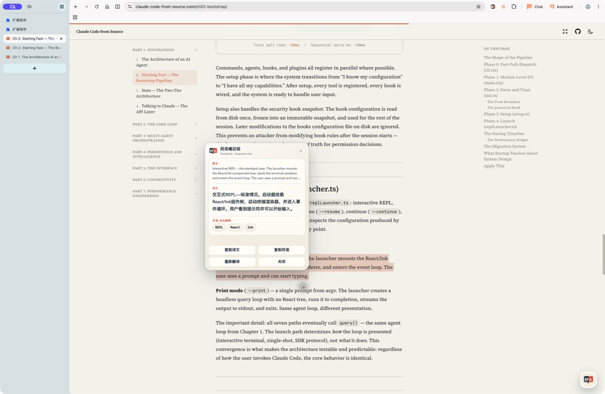
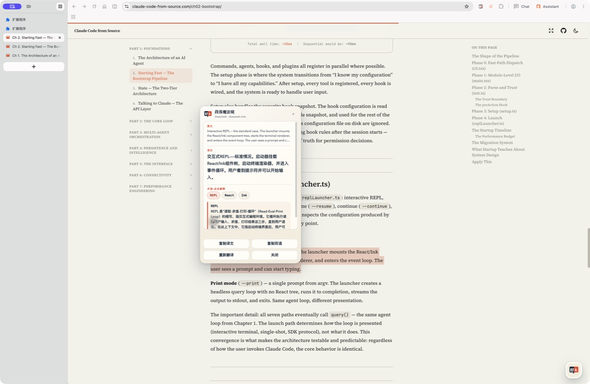

# 自带 Token 沉浸翻译

一个不依赖沉浸式翻译官方插件的开源浏览器扩展。它使用你自己的 DeepSeek 或其他 OpenAI-compatible API Token，在网页原文下方逐段显示译文。

## 当前能力

- DeepSeek 预设与自定义 OpenAI-compatible 服务
- 多套本地 Provider 配置、切换、编辑和删除
- 逐段双语翻译，保留原文和页面原有样式
- 段落魔法镜：划选词句后点击 A3 小按钮，只翻译所选内容，并按需解释缩写和专有名词
- 网页内悬浮控制器，随时查看进度、停止、重试或恢复原文
- 每段立即显示排队或翻译状态，不再出现长时间“没有反应”
- 当前视口正文优先、小首批快速出字、最多三批并发翻译
- 自动翻译页面后续追加的正文内容
- API Token 只保存在浏览器本机，不进入同步存储
- 远程 API 强制 HTTPS；仅 localhost 和 127.0.0.1 可使用 HTTP

首版聚焦普通网页文章。PDF、字幕、图片 OCR、输入框与可编辑区域、代码块、跨段落选区和跨设备配置同步不在当前范围内。

## 安装

1. 在 Chrome 打开 `chrome://extensions/`。
2. 开启“开发者模式”。
3. 选择“加载已解压的扩展程序”。
4. 选择本仓库的 [extension](./extension/) 目录。

无需构建，也没有运行时依赖。

## 配置 DeepSeek

1. 打开扩展的“设置”。
2. 选择“新建 DeepSeek”。
3. 填入 API Token；默认 Base URL 为 `https://api.deepseek.com/v1`。
4. 保留或修改模型名和目标语言。
5. 先点“测试连接”，成功后点“保存并使用”。

其他服务需要提供 OpenAI-compatible 的 `POST /chat/completions` 接口。Base URL 填到服务的 API 根路径，例如 `https://example.com/v1`。

## 使用

打开一篇网页文章，点击扩展图标，然后选择“开始翻译”。Popup 会显示完成、处理中和失败数量。你可以随时：

- 停止：中止当前请求，保留已经得到的译文；
- 重试失败：只重新提交失败或被停止的块；
- 恢复原文：只删除扩展插入的译文，不改动网页原节点。

只想查一个词或一句话时：

1. 用鼠标或键盘选择正文中的文字；选区旁会出现 A3 翻译按钮，此时内容仍只在本机。
2. 点击按钮后，卡片立即显示 loading，并使用当前 Provider 流式显示译文。
3. 翻译完成后，卡片会标出识别到的缩写和专有名词；点击词条才会请求解释，重复点击直接使用本次会话缓存。
4. 你还可以复制译文、复制“原文 + 换行 + 译文”、绕过缓存重新翻译或关闭。
5. 新建选区、点击外部、按 `Esc`、切换页面或关闭卡片会取消未完成的选区请求；整页翻译任务不受影响。

魔法镜不会处理输入框、`contenteditable`、`pre`、`code`、扩展生成的译文、跨语义容器或超过 2000 字符的选区。

## 段落魔法镜预览

划选段落并完成翻译后，魔法镜会在本地识别其中的技术缩写与专有名词：



点击 `REPL` 后，才会使用当前 Provider 生成结合上下文的简明解释：



截图来自 BrowserOS 中的真实网页测试。更多说明见 [段落魔法镜功能记录](./docs/features/paragraph-magic-lens/README.md)。

## Token 与隐私边界

- Token 存储在 `chrome.storage.local`，不会写入 `chrome.storage.sync`。
- Content Script 不会收到 Token、Base URL 或完整 Provider 配置。
- Service Worker 只向当前选中的 Provider origin 发送所选正文块，不发送完整 DOM、Cookie、表单值或页面脚本。
- 点击魔法镜前不发送任何选区数据；点击后只发送规范化选中文字和最多 4000 字符的当前语义段落纯文本上下文。上下文只用于消歧，不会复制到卡片或剪贴板。
- 选区缓存只保存验证后的译文和不可逆哈希，不保存选区或上下文明文；魔法镜消息不能覆盖 Provider、Base URL、模型、认证头或并发策略。
- API origin 权限按配置精确申请；删除或改址后会清理不再使用的权限。
- 拥有本机浏览器调试权限、操作系统账户权限或扩展目录写权限的人，仍可能读取本地 Token。建议使用独立、可撤销、有限额的 Token。

完整说明见 [PRIVACY.md](./PRIVACY.md)。

## 本地验证

需要 Node.js 20 或更高版本：

```bash
npm run verify
```

该命令执行语法检查和 Node 内置测试，不会安装第三方包。

浏览器验收记录与真实网站截图见 [tests/e2e/byok-translator/README.md](./tests/e2e/byok-translator/README.md)。

## 开源协议

本项目使用 MIT License，见 [LICENSE](./LICENSE)。
