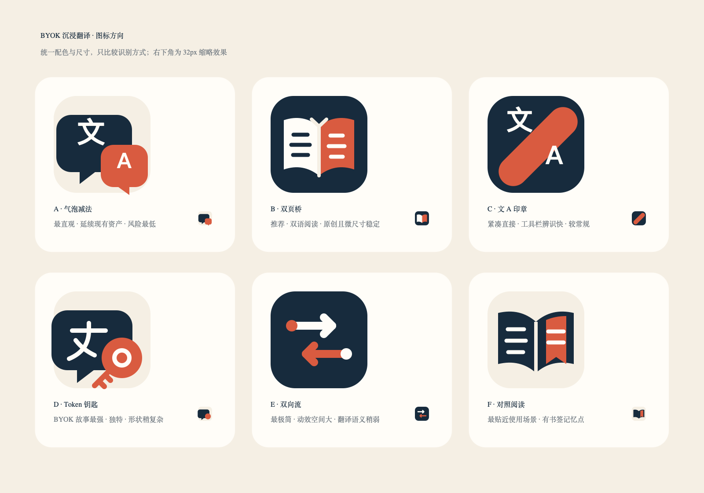
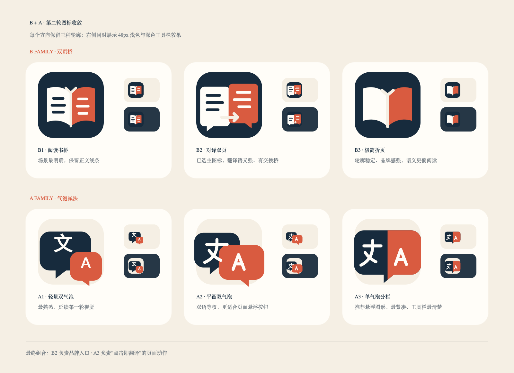

# 图标优化方向稿

本轮只比较图形语言，不修改扩展资源。六个方向统一使用现有品牌色：

- 海军蓝 `#172B3D`
- 珊瑚红 `#D95B40`
- 米白 `#F5EFE4`
- 暖白 `#FFFDF8`

## 方向对比

| 方案 | 核心想法 | 翻译识别 | 原创辨识 | 小尺寸 | 主要取舍 |
| --- | --- | --- | --- | --- | --- |
| A 气泡减法 | 把现有双气泡减少到两个主形和两个语言符号 | 高 | 中 | 高 | 最稳妥，但仍属于常见翻译图标语言 |
| B 双页桥 | 两页原文/译文由中间的桥连接 | 中高 | 高 | 高 | 更像独立品牌，第一次看到需要半秒理解 |
| C 文 A 印章 | 用一个双语印章强化“文 ↔ A” | 高 | 中 | 高 | 直观、紧凑，但容易接近其他翻译工具 |
| D Token 钥匙 | 把 BYOK 的钥匙与对话气泡合并 | 中 | 很高 | 中 | 项目故事最独特，但翻译含义不如 A/C 直接 |
| E 双向流 | 两条流线表现原文与译文实时转换 | 中 | 高 | 很高 | 极简现代，但可能被看作同步或刷新 |
| F 对照阅读 | 一本展开的双语书加译文书签 | 中高 | 高 | 中高 | 最符合沉浸阅读，但形状比 B/E 稍复杂 |

## 建议

优先深化 **B 双页桥**：它兼顾双语阅读、原创性和 16–32px 清晰度，也不会像传统“文+A”那样容易与其他翻译插件撞脸。

保留两个备选：

- **A 气泡减法**：如果更重视用户第一眼就知道是翻译。
- **D Token 钥匙**：如果更重视“自己的 API Token、自己掌控”的项目定位。

下一轮只需要选择 2–3 个方向，再为每个方向制作：

1. 16 / 32 / 48 / 128px 像素级版本。
2. 浏览器工具栏浅色与深色背景测试。
3. 页面悬浮按钮的 idle、翻译中、完成三种状态。
4. SVG 路径版和 Manifest PNG 导出。

## 第二轮：B + A 收敛

已选择 **B 双页桥** 与 **A 气泡减法** 继续深化。第二轮不改配色，只比较轮廓、翻译识别和小尺寸表现：

| 变体 | 定位 | 优点 | 风险 |
| --- | --- | --- | --- |
| B1 阅读书桥 | 延续第一轮 B | 阅读场景最清楚 | 更像阅读器，翻译含义略弱 |
| B2 对译双页 | 两个独立页面由交换箭头连接 | 翻译与对照兼顾 | 元素稍多，需要单独优化 16px |
| B3 极简折页 | 删除文字线，只保留双色书页和桥 | 轮廓稳定、品牌感强 | 第一次看到需要结合产品语境 |
| A1 轻量双气泡 | 延续第一轮 A | 最熟悉、最直观 | 与常见翻译图标相似 |
| A2 平衡双气泡 | 两个气泡等权并减少重叠 | 结构更稳，悬浮按钮更友好 | 视觉张力稍弱 |
| A3 单气泡分栏 | 把双语压缩进一个气泡 | 最紧凑，工具栏表现最好 | 双语对话感不如 A1/A2 |

最终选择是 **B2 作为扩展主图标，A3 作为悬浮按钮的交互图形**。B2 用双页和交换桥明确表达对译，A3 用紧凑的单气泡分栏承担“点击即翻译”。

