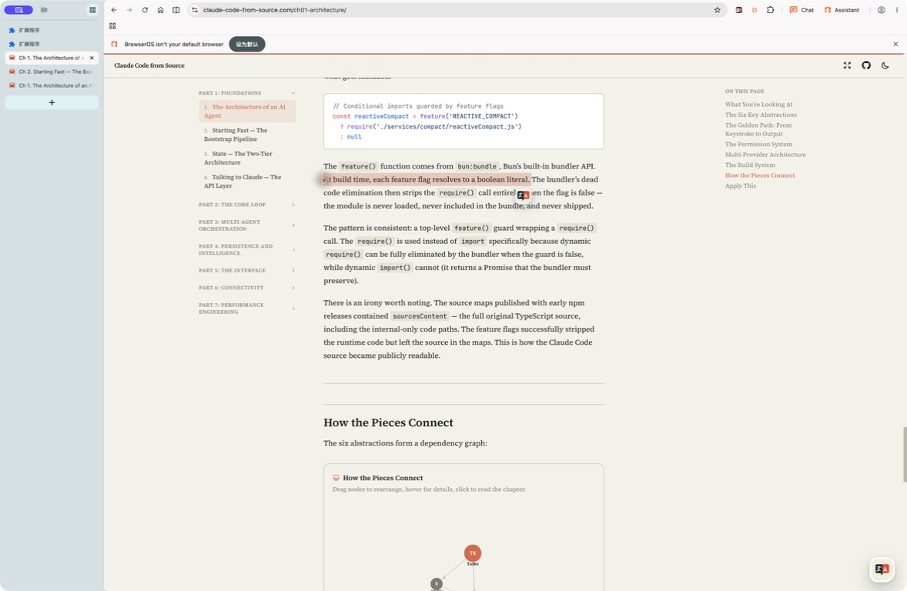
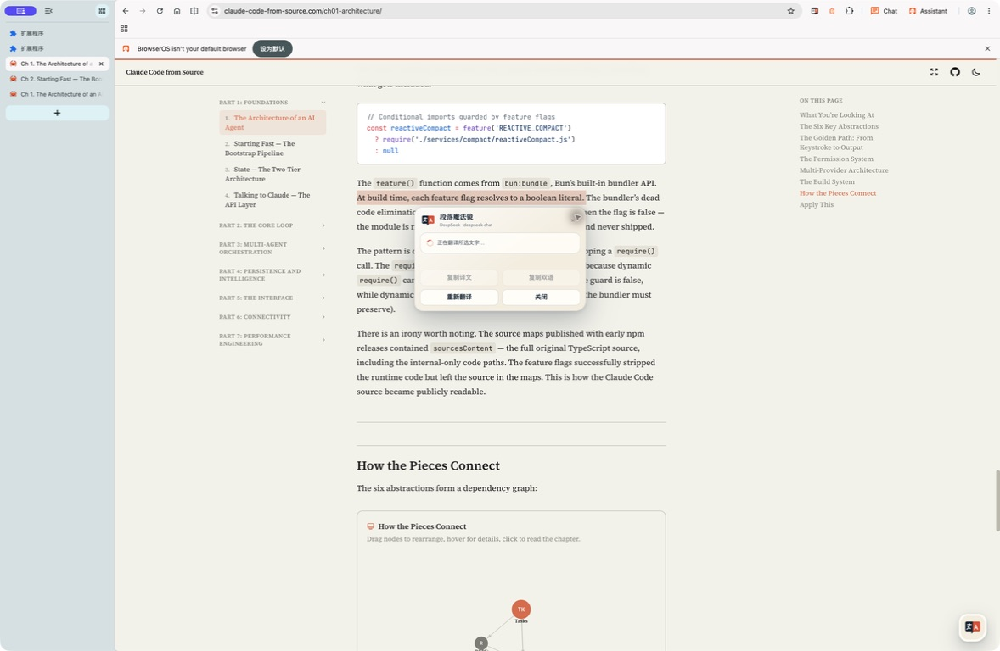
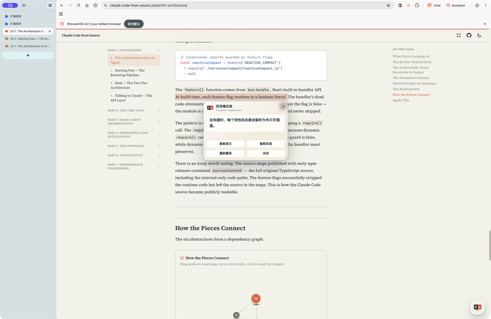
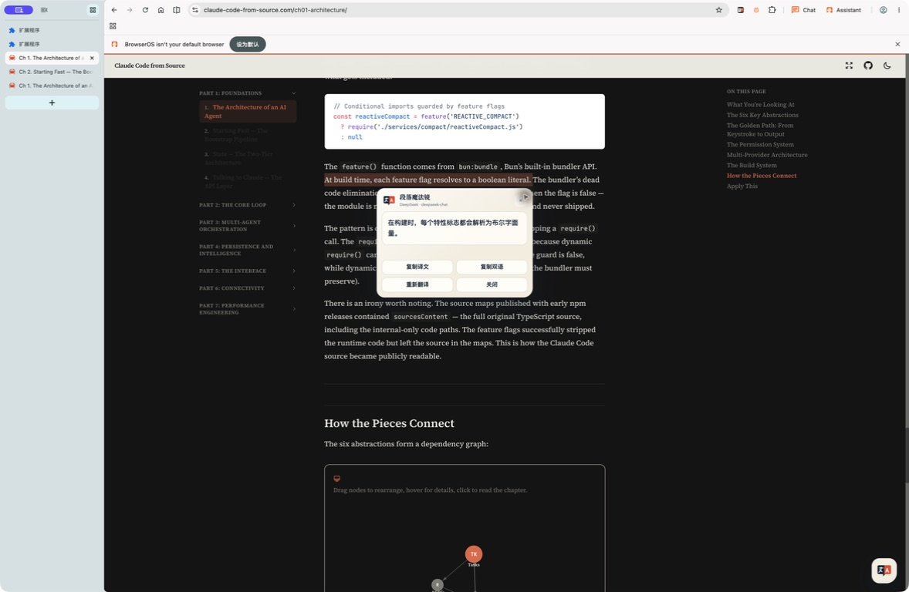
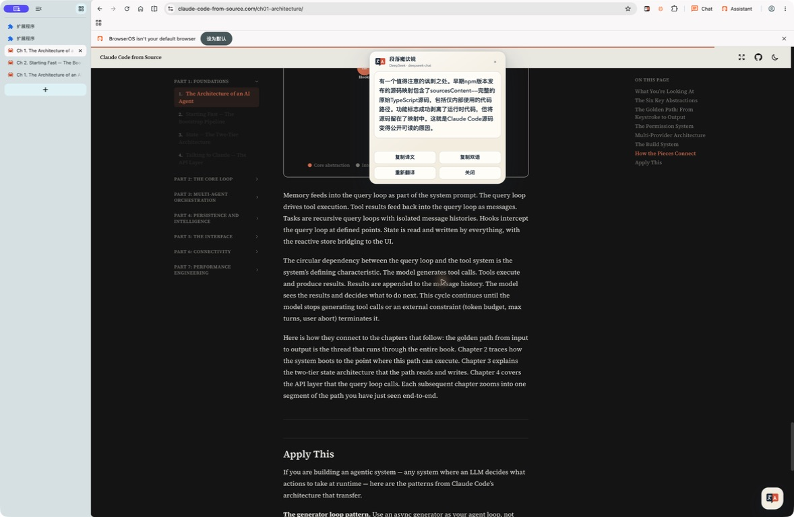
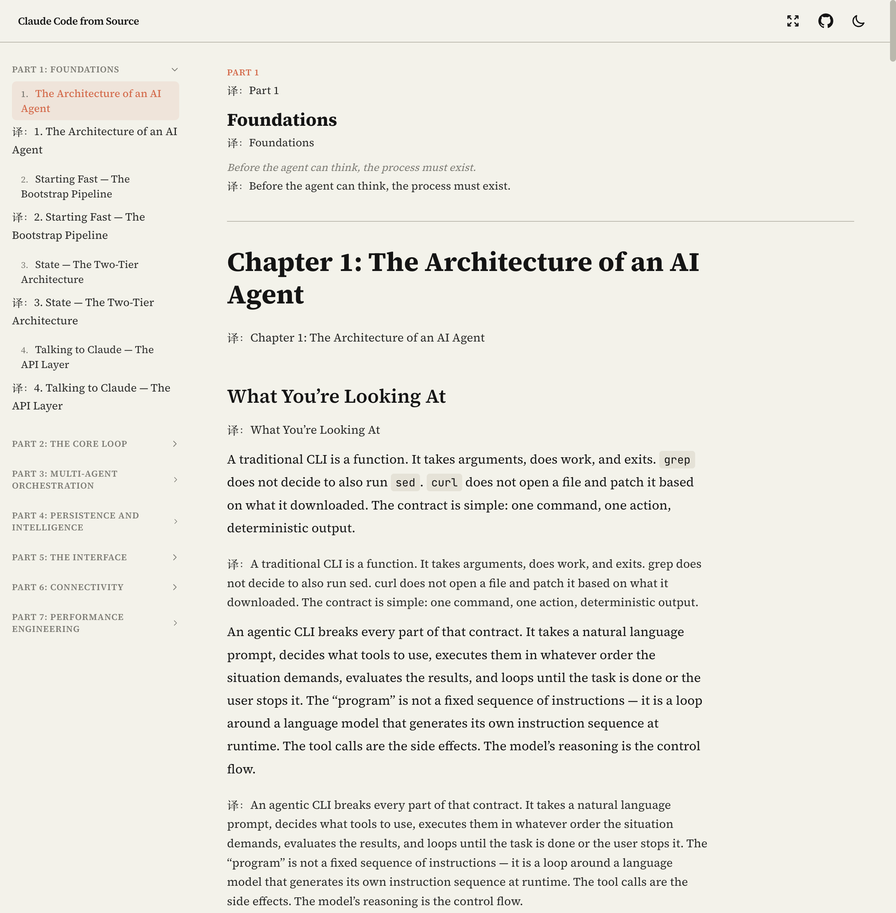
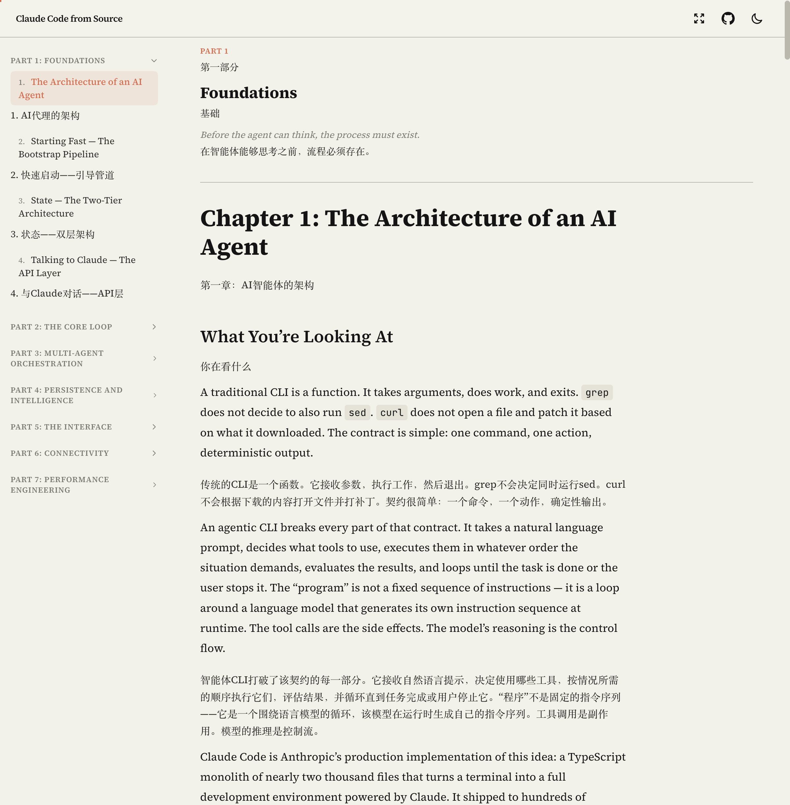

# BYOK 翻译扩展浏览器验收

## 环境

- 日期：2026-07-27
- 浏览器：Google Chrome for Testing 146.0.7680.80
- 扩展：Manifest V3 未打包目录
- API：本地 OpenAI-compatible mock 与真实 DeepSeek `deepseek-chat`
- 真实站点：[Claude Code from Source — Chapter 1](https://claude-code-from-source.com/ch01-architecture/)

本地 mock 返回 `译：` 加原文，用于验证分块、协议、状态和渲染；它不用于评价实际翻译质量。

## 已验证结果

- Options 中连接测试成功，Provider 与 Token 保存在本地。
- 普通测试夹具正确提取标题、段落、列表和嵌套正文。
- 代码、隐藏内容和表单输入未被翻译。
- 页面动态追加段落只翻译一次。
- 真实站点按 DOM 顺序插入 122 个译文块。
- Popup 关闭再打开后恢复 `122 / 122` 的权威进度。
- 恢复原文后译文节点为 0，原 H1 文本保持不变。
- 非法响应使 122 个块进入失败状态；修正 Provider 后，“重试失败”恢复到 122 个译文块。
- 慢速请求在 72/122 时停止；等待超过一个请求周期后仍为 72，没有迟到响应继续写入。
- 页面只使用 `textContent` 写入译文；模拟 HTML 模型输出不会作为页面标记执行。
- 使用用户在浏览器中亲自保存的真实 DeepSeek Token 完成 122/122 个文本块翻译；Token 始终保持掩码，未被读取或输出到测试日志。
- 真实返回示例包括“AI代理的架构”“快速启动——引导管道”“状态——双层架构”和“与 Claude 对话——API 层”。

## 2026-07-29 BrowserOS 性能与一键入口复测

- 浏览器：BrowserOS（Chromium 扩展运行环境）。
- 范围：默认“主要内容”，真实 DeepSeek 旧配置继续使用已保存的 `deepseek-chat`，没有被新预设迁移覆盖。
- 权限拒绝状态下页面不自动出现控制器；授权普通网页访问并刷新后，悬浮控制器自动出现。
- 清空 session 缓存并重载扩展后，固定 ID 的动态 Content Script 仍以 `persistAcrossSessions: true` 注册，目标页无需再次打开 Options 即恢复悬浮入口。
- 冷启动时，一键命令在约 50ms 内返回并为首屏 9 段建立处理态；首个真实 DeepSeek 译文从 loading 到出现约 0.70s。后台扫描随后扩展到 77 个正文块，滚动到正文中段后最终达到 77/77。
- 缓存复测中，首批处理态约 17ms 出现，首批译文约 22ms 出现；首屏不再等待网络往返。确定性自动化基准另行断言缓存命中视口在 300ms 内完成且请求数为 0。
- 翻译中停止后没有迟到结果继续写入；恢复原文后 `[data-byok-translator]` 译文节点和 `[data-byok-block-id]` 源文标记均为 0，悬浮控制器保留。
- 清除旧日志并重载当前版本后，再完成真实翻译与恢复流程，Chrome 扩展错误页没有新增错误或警告。

扩展自身的首批反馈已经稳定在百毫秒内；真实首 token 仍受 DeepSeek 网络、模型负载与限流影响。调度器会在 429、503 或连续高延迟时主动降并发，因此整页完成时间可能随 Provider 波动，但不会阻塞首屏 loading 和缓存命中路径。

## 2026-07-30 富文本格式基线

用户提供的 “5. Memory” 段落包含粗体标题以及 `memdir/`、`CLAUDE.md`、`~/.claude/MEMORY.md` 三处行内代码。当前版本把整个中文译文写入单个纯文本节点，因此文字内容可读且不存在 HTML 注入，但粗体和行内代码语义全部丢失。

本基线用于验收 `preserve-translation-formatting`：完成后相同段落必须保留对应格式，同时模型 HTML、任意属性、链接地址和站点样式仍不得直接成为译文 DOM。

## 2026-07-30 富文本格式验收

- 重新加载 BrowserOS 中的未打包扩展后，在[真实文章](https://claude-code-from-source.com/ch01-architecture/)通过悬浮按钮完成 73 个 canonical 块、77 个页面块的翻译。
- “5. Memory” 的中文译文包含 1 个 `strong` 与 3 个 `code` 节点；`memdir/`、`CLAUDE.md`、`~/.claude/MEMORY.md` 在中英文语序变化后仍归属正确。
- 再次点击悬浮按钮后，译文节点和源文状态标记均恢复为 0；原段落的 `innerHTML`、1 个 `strong` 和 3 个 `code` 与翻译前完全一致。
- 第二次启动后同一段译文及格式完整复现；自动化性能用例同时验证格式完整/降级缓存命中的视口请求数为 0。
- 模型 HTML、畸形/未知/重复/错误嵌套标记和危险链接由确定性协议及渲染测试覆盖，只会生成白名单 DOM 或纯文本降级。
- 清除旧错误并完成翻译、还原和缓存复测后，BrowserOS 扩展错误页没有新增条目。

当前不保留表格结构、图片、SVG、数学公式、代码块高亮和站点自定义组件等复杂布局。Provider 若遗漏或改写不透明格式标记，扩展会保留可读译文并降级为纯文本；因此格式完整率仍受 Provider 的指令遵循度影响，但不会扩大 DOM 安全边界。

## 2026-07-30 译文字体验收

- BrowserOS Options 能选择默认、Maple Mono 和自定义本机字体；本机 `Maple Mono NF CN` 被识别为已安装，正文与 `code`/`kbd` 预览分别使用正文和等宽回退栈。
- Chromium 的 `document.fonts.check()` 会把不存在的 `Definitely Missing BYOK Font` 误报为可匹配；增加 Canvas 字宽对照后，Options 正确提示未安装，同时仍允许保存并使用系统回退。
- 在[真实文章](https://claude-code-from-source.com/ch01-architecture/)完成 77/77 个页面译文；Maple Mono 只出现在 `.byok-translator__translation[data-byok-translator]` 及其行内代码中，原文与文章容器继续使用网站的 `Source Serif 4 Variable`。
- 翻译保持开启时切换默认、自定义缺失字体和 Maple Mono，首个译文的 DOM 引用、文本、`data-byok-for` 和总节点数均保持不变；自动化回归同时确认字体偏好不进入 Provider 请求或缓存键。
- 自定义 `url(https://evil.example/font.woff2)` 被拒绝，反馈明确说明只接受本机 family，存储中的上一份 Maple Mono 设置保持不变。
- 再次点击悬浮按钮后，译文节点、根元素/正文字体变量和带字体变量的内联样式残留均为 0，原文节点仍连接且字体不变。
- 当前权限仍只有 `activeTab`、`scripting`、`storage` 及既有可选 HTTP/HTTPS 站点访问；没有新增字体权限、远程字体加载或静态网站匹配。
- 清除既有 Provider 失败日志后，再完成字体保存广播与恢复原文检查，BrowserOS 扩展错误页没有新增条目。

字体检测是提示而非渲染前提：Canvas 字宽相同的极少数字体仍可能出现假阴性，但不会阻止保存，CSS 始终追加确定性的系统回退栈。真实 Provider 的整页完成时间仍会受网络、模型负载和限流影响，字体热更新本身不发起网络请求。

## 2026-08-02 段落魔法镜验收

- 浏览器：BrowserOS；站点：[Claude Code from Source — Chapter 1](https://claude-code-from-source.com/ch01-architecture/)；Provider：已保存的真实 DeepSeek `deepseek-chat`。
- 重新加载未打包扩展并刷新文章后，选择普通英文短句会在选区末端显示 A3 按钮；点击前 Service Worker 没有收到选区请求。跨入行内 `code` 的选区不显示入口。
- 点击后卡片立即展示“正在翻译所选文字…”，随后流式显示纯文本结果。实测 `At build time, each feature flag resolves to a boolean literal.` 得到“在构建时，每个特性标志都会解析为布尔字面量。”
- 关闭后重新选择同一句，首次状态采样已经是完成结果；确定性测试另行锁定缓存命中 300ms 目标及零远端请求。点击“重新翻译”会重新进入 loading 并绕过缓存读取。
- 在重新翻译的 loading 阶段关闭卡片，等待 2.5 秒没有迟到结果重新打开卡片。
- 暗色页面中按钮和卡片保持可辨识；选区靠近视口底边时入口保持在安全区域。
- 首轮滚动验收发现选区滚出顶部后卡片会沿用负纵坐标；修复双向视口限制并重载后，卡片稳定停在顶部 12px 安全边距内。
- 整页翻译运行期间重新选择句子并启动魔法镜，两条任务独立推进：页面继续插入译文，魔法镜完成独立流式结果；随后恢复整页原文不会留下页面译文节点。
- 真实 Provider 配置未被故意破坏来制造认证失败；无 Provider、认证、限流、网络、无效响应和重试状态由后台集成测试覆盖。真实慢响应、显式重新翻译和取消恢复路径均已在 BrowserOS 验证。
- 清空旧扩展错误后完成一次新的真实选区翻译，BrowserOS 扩展错误页没有新增条目；随后打开 `service-worker.mjs` DevTools，控制台为 `0 messages`，未出现 API 凭据、选区或上下文明文。

### 魔法镜视觉证据

## 视觉证据

当前轻量双语样式：

样式依据用户提供的沉浸式翻译原版截图收敛为“原文下方自然跟随译文”，不再使用醒目的卡片背景和边框。

真实 DeepSeek 翻译结果：

## 尚未覆盖

- 其他浏览器不属于首版范围。
- PDF、字幕、图片 OCR 和复杂 Web App 编辑器不属于首版范围。
